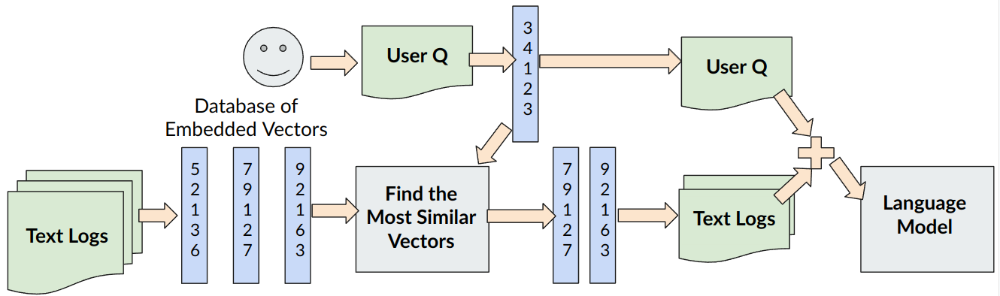

# TokamakText

### Pip Environment
1. Make pip environemnt
2. `python3 -m pip install chromadb python-dotenv openai flask h5py`

### Set up OPEN AI Keys
Go to OPEN AI website and set-up billing information and get API key. You can set usage limits to make sure you don't get charged more than $1 or so. 

Copy OPENAI key to a file you make called `.env` in the `rag/` directory with the line: `OPENAI_API_KEY="YOUR_KEY"`

### Set-up embeddings
Move to `rag/` directory and do everything else there. Run `python3 embed_data.py h5_file` to turn a h5 file into a file full of embeddings. Make sure the embeddings end up in a `db/` directory in the `rag/` directory, not the main directory. 

### Run rag server
Run `python3 rag_server.py` and make queries to the local website. By default, this will use the OpenAI API, but you can run a huggingface model (e.g. LLAMA) instead by typing `python3 rag_server.py --model_name huggingface`.
